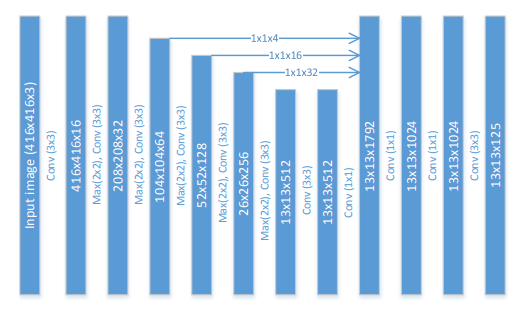

# Object detection at 200 Frames Per Second
## 摘要
针对网络结构、loss函数和训练数据三个方面对目标检测框架进行了改进。网络结构方面开发了一个轻量级的且满足性能的紧凑架构；损失函数方面使用了**蒸馏损失函数**，提出了各种创新方案来促使蒸馏单阶段检测流程更加有效，称为objectness scaled distillation loss, feature map non-maximal suppression以及一个用于检测的统一distillation loss function；最后，文章探索了利用未标记数据来改进性能的方法，使用教师网络的soft labels让未标注数据训练我们的网络。
性能上参数量只有VGG的十分之一，速度可以超过200FPS，在Pascal数据集上可以得到检测正确率的14mAP的提升

## 1. 介绍
知识蒸馏用于目标检测的文献有两篇：
+ Learning efficient object detection models with knowledge distillation
+ Mimicking very efficient network for object detection

本文在知识蒸馏方面的贡献：
+ 第一个将蒸馏用于单阶段检测框架（YOLO），之前的工作是将蒸馏用于区域推选网络
+ 为了将蒸馏用于检测，本文提出feature map-NMS（FM-NMS）用于抑制重叠检测所对应的激活
+ 通过强调在教师检测中具有较高目标值的检测，将问题看做是一种目标缩放蒸馏损失问题

在数据利用方面参考了data distillation文章的方法，但是在两个方面不一样：
+ 本文从老师网络的卷积特征图上迁移软标签
+ 本文通过目标缩放以及蒸馏权重设置的损失函数使得老师标签所给的权重是可控的

## 2. 结构
本文选择的老师框架是YOLO，学生框架是Tiny-YOLO，对学生框架进行了一定的改进：
+ Dense特征图的堆叠：
+ 深但是窄：
+ 整体架构：上面对架构的修改本身可以让Tiny-Yolo提升5个mAP，同时可以比Tiny-Yolo快20%。整体架构如下图所是

## 3. 训练过程中的蒸馏损失
yolo损失函数以及最后一层的简单回顾：

+ 最后一层特征图的每个cell都需要预测$N$个boundingbox，N就是anchorboxes的数量，因此特征图的数量是$N\times(K+5)$，其中$K$是类别对应的索引号，5是对应的boundingbox坐标和目标置信度。每个cell的每个anchorbox都需要预测：类别、类别置信度以及boundingbox坐标，yolo损失函数的公式：
$$L_{Yolo}=f_{obj}(o^{gt}_{i}, \hat{o}_i)+f_{cl}(p^{gt}_{i}, \hat{p}_i)+f_{bb}(b^{gt}_{i}, \hat{b}_i)$$

$f_{obj}$是预测与groundtruth之间的IOU；$f_{cl}$是给定类别存在目标的概率；$f_{bb}$是图片尺寸相关的坐标；损失函数分别使用简单的L1和L2函数。

直接在最后一层的输出上使用distillation的问题在于，单阶段检测器的密集采样会直接导致蒸馏无效。具体问题下面讨论。

### 3.1 目标缩放蒸馏
yolo这样的单阶段检测器在最后一层会预测出非常密集的candidates，在推理时会通过类别置信度来淘汰背景过多的boundingbox。蒸馏的传统过程中是不存在淘汰boundingbox的步骤的。教师网络给太多错误的boundingbox是会影响学生网络的boundingbox训练的。为了避免学习教师网络那些背景过多的区域，本文将distillation loss制定为对象缩放函数，意思是只有在教师预测的类别置信度很高时才学习boundingbox坐标和类别置信度。

蒸馏时采用的损失函数分别修改为：
$$f^{Comb}_{obj}(o^{gt}_i,\hat{o_i},o^T_i)=\underbrace{f_{obj}(o^{gt}_i,\hat{o_i})}_{\text{Detection loss}}+\underbrace{\lambda_D\cdot{f_{obj}(o^T_i,\hat{o_i})}}_{\text{Distillation loss}}$$

$$f^{Comb}_{cl}(p^{gt}_i,\hat{p_i},p^T_i,\hat{o^T_i})=f_{cl}(p^{gt}_i,\hat{p_i})+\underbrace{\hat{o^T_i}\cdot\lambda_D\cdot{f_{cl}(p^T_i,\hat{p_i})}}_{\text{objectness scaled distillation}}$$

$$f^{Comb}_{bb}(b^{gt}_i,\hat{b_i},b^T_i,\hat{o^T_i})=f_{bb}(b^{gt}_i,\hat{b_i})+\underbrace{\hat{o^T_i}\cdot\lambda_D\cdot{f_{bb}(b^T_i,\hat{b_i})}}_{\text{objectness scaled distillation}}$$

基于缩放动作的objectnes作为单阶段检测器蒸馏的过滤器，它将给背景较多的cell非常低的权重。看起来更像目标的前景区域会在教师网络中具有非常高的目标置信度，所定义的蒸馏损失利用了这些区域的教师知识。值得注意的是，损失函数保留了相同的部分，但是对于蒸馏，本文仅仅增加了教师的输出而不是使用ground truth。

### 3.2 Feature Map-NMS
原始的Yolo中有许多cells和anchorboxes都是预测的同一个物体，因此，NMS对于目标检测架构来说是非常必要的后处理手段。但是，NMS被用在端到端的网络结构外面，高度重叠的预测是在最后一层卷积层上表示的。当这些预测从教师网络传到学生网络时会导致冗余信息。因此，我们观察到上面所描述的蒸馏损失会导致性能损失，因为教师网络对于高度重叠的检测会停止传送信息。和高度重叠的检测相对应的特征图不会对相同的目标类别和维度传递大的梯度，从而导致网络过拟合。

为了克服重叠检测的问题，本文提出Feature Map-NMS。背后的思想是如果$K\times{K}$个ceils附近的多个candidates对应着相同的类别，那么它们可能在图片中对应相同的目标。因此，我们仅仅选择其中最大置信度的那个candidate。实践中，我们在最后一个特征图上检测类别置信度的激活情况，将对应相同类别的激活设为零。教师网络使用soft labels作为检测结果。教师网络的最后一层在围绕狗的区域内预测出一组boundingboxes。为了抑制重叠检测，我们挑选最高目标置信度的检测结果。重叠的candidates中最强的candidate被传递到学生网络。在本文的实验中使用的cell领域是3×3

## 4. 数据的有效性
这一节描述我们应该怎么使用更多的训练数据来提升性能。
+ 标注数据：增加更多的标注数据是最直接的方法。
+ 未标注数据：本文将未标注数据和蒸馏损失结合在一起。主要想法是在可用的时候使用soft labels和groundtruth label。当ground truth不可得时仅仅使用教师网络的soft labels。实践中，当ground truth不存在时，我们只传播损失的教师部分，否则就传播2-4描述的损失组合。因为目标函数无缝整合了soft-label和ground truth，这使得我们可以用标注数据和未标注数据一起训练网络。
